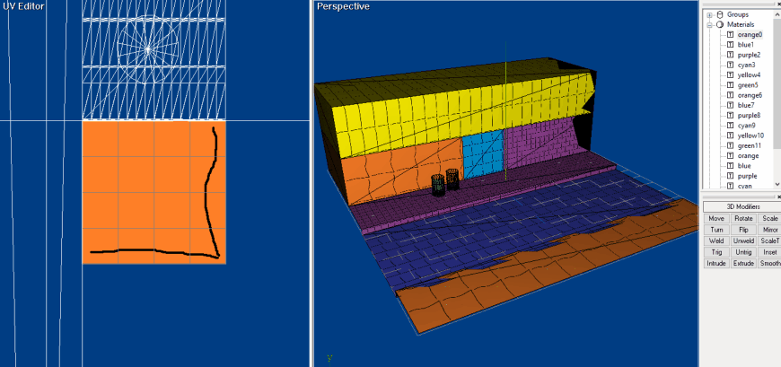
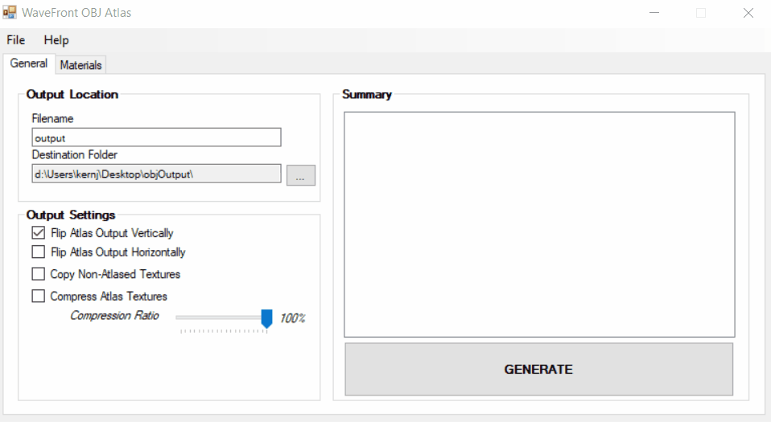
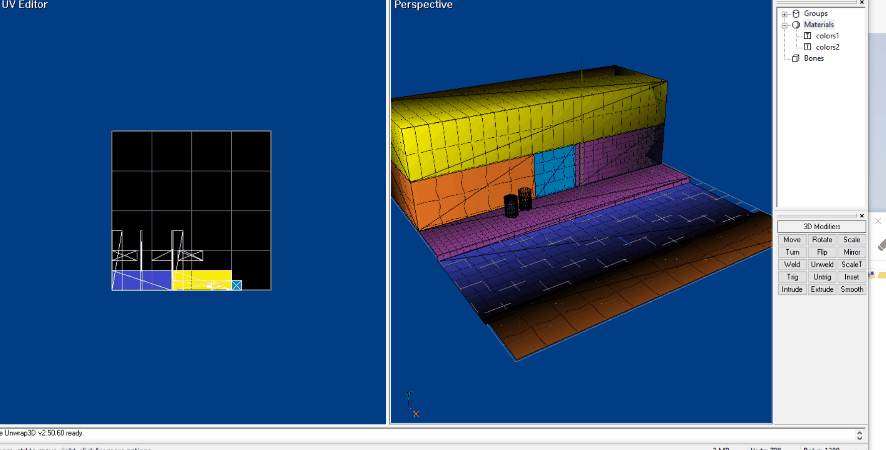

# WaveFront Texture Atlas

This repository contains a functional - but roughly implemented - way to generate a texture atlas from a [WaveFront file (*.obj)](https://en.wikipedia.org/wiki/Wavefront_.obj_file) and also remap applicable texture coordinates.

The solution was written in C#, .Net Framework v4.6.1, and WinForms. There are plenty of improvement opportunities with this repository. :)

Exploring the original model in Ultimate Unwrap 3D

Using the tool to create an atlas and remap coordinates

Exploring the atlased and remapped model in Ultimate Unwrap 3D

